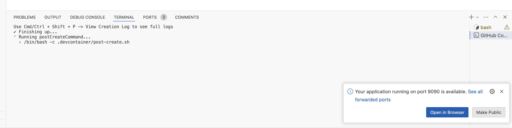
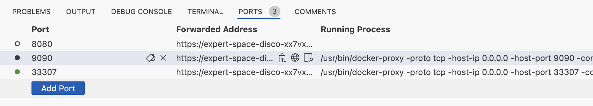

# Argo CD Admin Workshop

The repository demonstrates how to bootstrap and manage Argo CD.

## Bootstap Argo CD and deploy sample application

The first exercise is to bootstrap Kubernetes cluster and install Argo CD using Github Codespaces environment.

1. Fork https://github.com/akuity/argocd-admin-training repositorty

2. Create Codespace.
  * Navigate to forked repository
  * Click on `Code -> Codespaces -> +`
  * Wait for codespace to be successfully initialized

  

3. Install Argo CD resources and ensure deployment has started successfully

```shell
kustomize build argocd | kubectl apply -f -
kubectl rollout status deploy/argocd-server -n argocd
```

4. Access Argo CD UI

  * Click `Ports` tab in Github Codespaces UI
  * Locate 9090 port and open URL in browser
  
  * Login using username `admin` and password `password`

5. Configure Argo CD CLI access

```shell
argocd login localhost:9090 --username admin --password password --insecure --plaintext --grpc-web
```

## Switch to declarative management

Argo CD allows using web user interface and CLI to manage most of the settings. However it is recommended to manage settings declarativelly
using Argo CD itself. During this exersice we are configuring declarative management and performing declarative upgrade.

1. Create Argo CD application that manages Argo CD itself

```shell
argocd app create argocd --repo https://github.com/$GITHUB_USER/argocd-admin-training --path argocd --dest-namespace argocd --dest-name in-cluster
```

2. Perform declarative upgrade
  * Change `v2.10.6` to `v2.10.7` in [argocd/kustomization.yaml](argocd/kustomization.yaml) and push changes to Git repository:
  * Navigate to Argo CD UI & Oopen `argocd` application details page.
  * Preview changes and click `Sync` button to perform deploy.

## Configure multi-tenancy

Argo CD is designed to serve needs of multiple teams and provides reach set of multi-tenancy features. For example
it allows having muliple users by creating local account or configuring SSO integation. Users can be separate from each
other using Argo CD projects. In this exercise we are going to declaratively configure local account and a project.

1. Uncomment `components: [team1]` in [argocd/kustomization.yaml](argocd/kustomization.yaml) and push changes to Git repository.
2. Navigate to Argo CD UI & Oopen `argocd` application details page.
3. Preview changes and click `Sync` button to perform deploy.
4. Find a new account in `Settings->Accounts` page.

## Automate application creation

Argo CD allows users to create applications manually using web interface or CLI. However, Argo CD provides a way to automatically
generate application based on predefined convention using the ApplicationSet component. In this exercise we are going to automatically create
applications for each Helm values file under `apps/<team-name>` directory. Example:

```yaml
apps
└── team1
    ├── chart
    └── qa.yaml # ApplicationSet generates application `team1-qa` in a project `team1` using helm chart under `apps/team1` and value file `qa.yaml`
```

1. Replace `<GITHUB_USERNAME>` with your username in [argocd/appset.yaml](argocd/appset.yaml)
2. Uncomment `- appset.yaml` in [argocd/kustomization.yaml](argocd/kustomization.yaml)
3. Create `apps/team1/qa.yaml` file and push changes to Git repository:

```shell
cat >apps/team1/qa.yaml <<EOL
image:
  repository: gcr.io/heptio-images/ks-guestbook-demo
  tag: 0.2
EOL
```
4. Navigate to Argo CD UI and see new application is created by application set